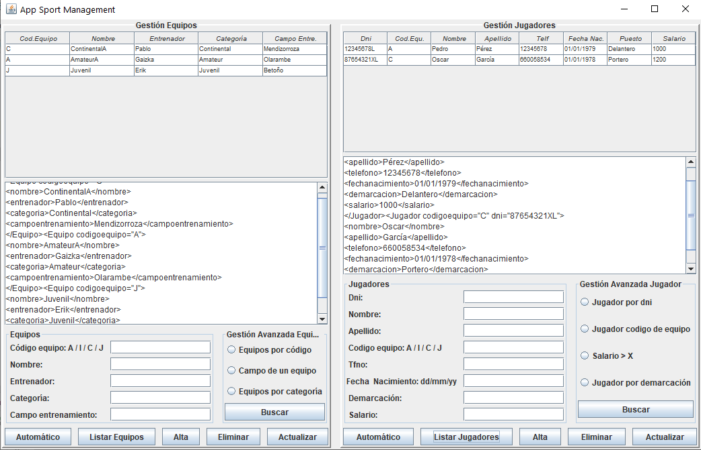

# Sport Management

Sport Management es una aplicación de gestión deportiva creada con el lenguaje de programación de Java, versión 1.8.0_231 y
mediante el entorno de desarrollo de IntelliJ IDEA Ultimate 2019.2.3

### Objetivo de la aplicación

El objetivo de Sport Management es la gestión de los equipos y jugadores de un club deportivo, es decir, establecer consultas,
modificar e insertar datos referentes a esos jugadores y equipos.

Para ello se ha utilizado las tecnologías de archivos XML, y consultas sobre dichos archivos ayudándose de las funcionalidades
de DOM, XPath y Xquery.

### Estructuración del proyecto

Se ha establecido una estructuración de proyecto tratando de seguir la arquitectura MVC 

***MVC***

Por un lado está el paquete vista que es donde se aloja la clase AppWindow que representa la interfaz gráfica de usuario, 
un paquete resources en el que está dos clases encargadas de crear las colecciones de los archivos Xml, el paquete modelo 
donde se crean las clases Equipo y Jugador, asi como, las clases Modelo para el control de los JTable de la aplicación, y 
por último el paquete controlador donde se encuentran las clases que representan las consultas utilizando DOM, XQuery y 
XPath.

***XQuery***

***XPath***

### Manual de usuario

La aplicación se muestra mediante la siguiente interfaz de usuario donde el usuario interactua mediante los componentes
de JavaSwing que se aprecian en la imagen.

La aplicación partirá sin nigún dato, es decir, sin ningún jugador ni equipo por lo que tendrá dos opciones de crear los
datos que estarán reflejados en las colecciones:

    - Mediante el botón automático que creará dos elementos correspondiente a la colección con la que se interactúa.
    - O bien rellenando los textfields correspondientes y dando al botón de alta.
    
Realizando esto las colecciones de la aplicación se irán llenando de datos y estos se podrán ir modificando interactuando 
diractamente con la tabla, habrá que selccionar una fila de la tabla correspondiente y editarla en el el caso del botón 
actualizar para realizar el resto de operaciones de los botones.

En el caso de listar simplemente se verán las colecciones tanto en el TextArea y Tabla correspondiente.

Se habilita también un espacio para consultas avanzadas donde habrá que seleccionar el radioButton correspondiente y rellenar
el texfield necesario para que el botón buscar funcione correctamente. Hecho esto se mostrará en el TextArea la información
solicitada.

### Referencias

[XPath](https://www.w3.org/TR/1999/REC-xpath-19991116/)

[XQuery](https://www.w3.org/TR/xquery-31/)

[DOM](https://docs.oracle.com/javase/tutorial/jaxp/dom/when.html)

### Vídeo tutorial

[Ver vídeo tutorial](https://youtu.be/oyjlkzDM72g)

