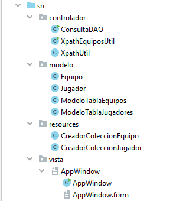
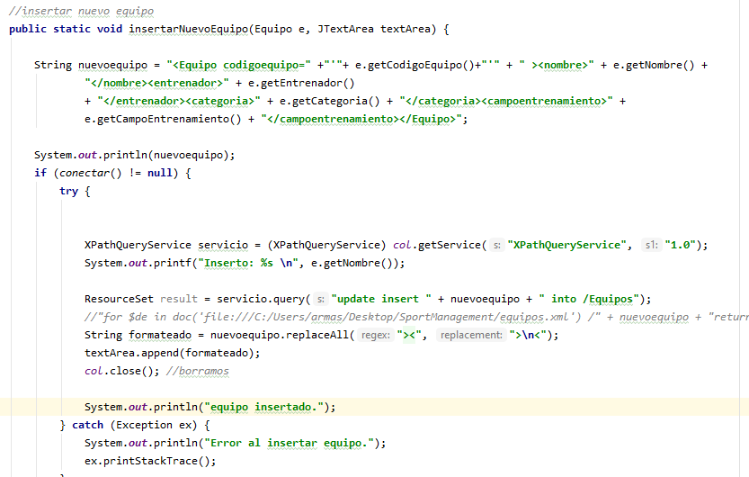
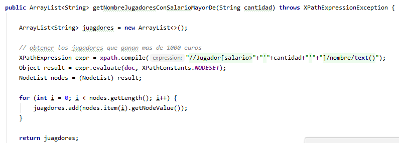

# Sport Management

Sport Management es una aplicación de gestión deportiva creada con el lenguaje de programación de Java, versión 1.8.0_231 y
mediante el entorno de desarrollo de IntelliJ IDEA Ultimate 2019.2.3

### Objetivo de la aplicación

El objetivo de Sport Management es la gestión de los equipos y jugadores de un club deportivo, es decir, establecer consultas,
modificar e insertar datos referentes a esos jugadores y equipos.

Para ello se ha utilizado las tecnologías de archivos XML, y consultas sobre dichos archivos ayudándose de las funcionalidades
de DOM, XPath y Xquery.

### Estructuración del proyecto

Se ha establecido una estructuración de proyecto tratando de seguir la arquitectura MVC 

Por un lado está el paquete vista que es donde se aloja la clase AppWindow que representa la interfaz gráfica de usuario, 
un paquete resources en el que está dos clases encargadas de crear las colecciones de los archivos Xml, el paquete modelo 
donde se crean las clases Equipo y Jugador, asi como, las clases Modelo para el control de los JTable de la aplicación, y 
por último el paquete controlador donde se encuentran las clases que representan las consultas utilizando DOM, XQuery y 
XPath.

